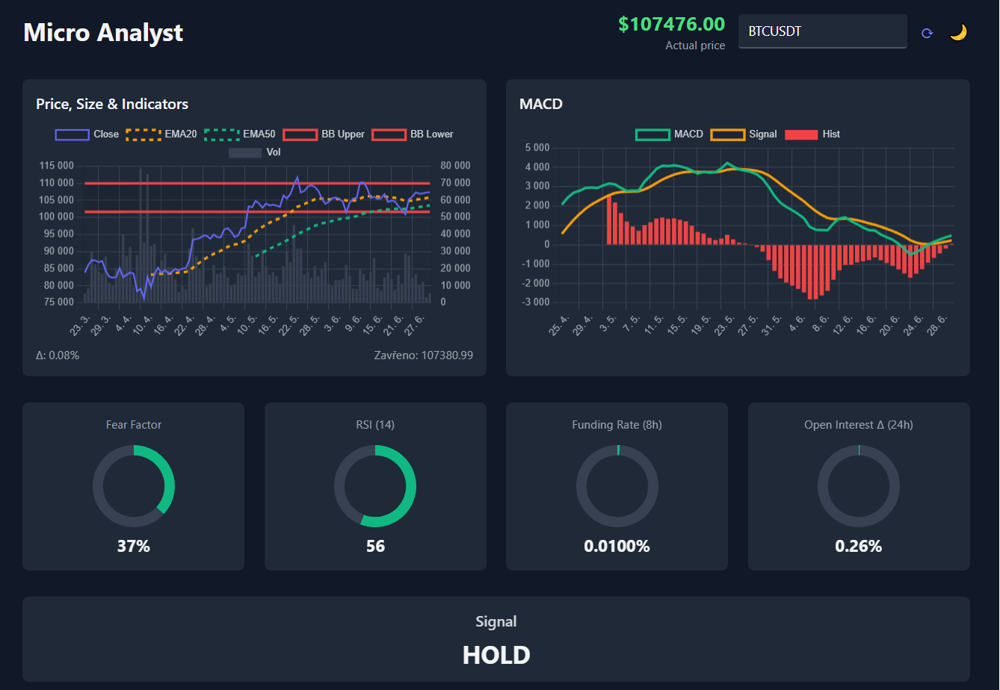

# Micro Analyst

A real-time cryptocurrency trading dashboard that displays technical indicators, market data, and trading signals for any cryptocurrency pair from Binance.



## Features

✨ **Real-time Price Updates** - Live price feed via WebSocket  
📊 **Technical Indicators** - EMA20, EMA50, RSI, MACD, Bollinger Bands  
📈 **Interactive Charts** - Price charts with volume and technical overlays  
⚡ **Market Metrics** - Fear Factor, Funding Rate, Open Interest changes  
🎯 **Trading Signals** - Automated BUY/SELL/HOLD recommendations  
🌙 **Dark/Light Theme** - Toggle between themes with full chart adaptation  
🔄 **Symbol Search** - Analyze any USDT trading pair  

## Quick Start

1. **Clone the repository**
   ```bash
   git clone https://github.com/FlyUltra/micro-analyst.git
   cd micro-analyst
   ```

2. **Open in browser**
   ```bash
   # Simply open index.html in your web browser
   open index.html
   ```

3. **Start analyzing**
   - Enter any cryptocurrency symbol (e.g., ETHUSDT, ADAUSDT)
   - Click refresh button or press Enter
   - Toggle theme with moon/sun icon

## How It Works

The dashboard connects to Binance's public APIs to fetch:
- **Historical data** for charts and indicator calculations
- **Real-time prices** via WebSocket connection
- **Funding rates** for futures sentiment
- **Open interest** changes for market momentum

## Technical Indicators

| Indicator | Description |
|-----------|-------------|
| **EMA20/50** | Exponential Moving Averages for trend analysis |
| **RSI** | Relative Strength Index (14-period) for momentum |
| **MACD** | Moving Average Convergence Divergence for signals |
| **Bollinger Bands** | Volatility bands around price action |
| **Fear Factor** | Custom volatility-based market sentiment |

## Signal Logic

- **STRONG BUY**: RSI < 30 + Positive funding rate
- **BUY**: RSI < 30 (oversold condition)
- **STRONG SELL**: RSI > 70 + Negative funding rate  
- **SELL**: RSI > 70 (overbought condition)
- **HOLD**: All other conditions

## Dependencies

All dependencies are loaded via CDN:
- [Tailwind CSS](https://tailwindcss.com/) - Styling
- [Chart.js](https://www.chartjs.org/) - Charts and graphs
- [Luxon](https://moment.github.io/luxon/) - Date/time handling

## Browser Compatibility

- ✅ Chrome/Chromium 80+
- ✅ Firefox 75+
- ✅ Safari 13+
- ✅ Edge 80+

## API Usage

This project uses Binance's **public APIs** only:
- No API keys required
- No rate limiting for basic usage
- Real-time data via public WebSocket streams

## Contributing

1. Fork the repository
2. Create your feature branch (`git checkout -b feature/amazing-feature`)
3. Commit your changes (`git commit -m 'Add amazing feature'`)
4. Push to the branch (`git push origin feature/amazing-feature`)
5. Open a Pull Request

## Disclaimer

This tool is for educational and informational purposes only. Always do your own research before making any trading decisions. Cryptocurrency trading involves substantial risk of loss.

---

**⭐ Star this repo if you find it useful!**
